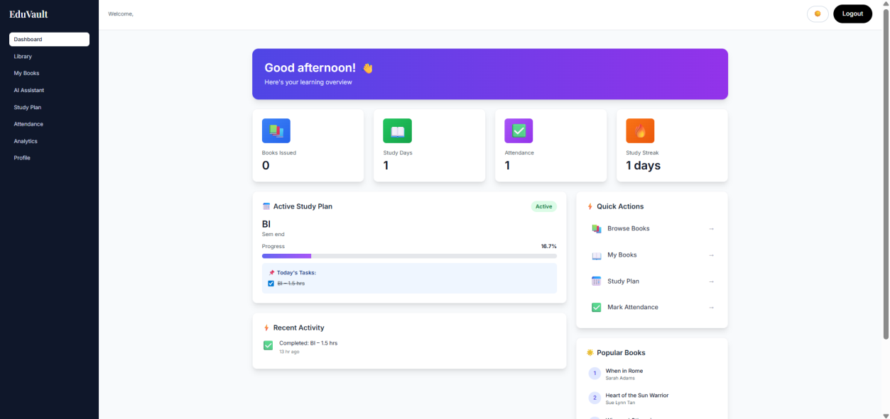
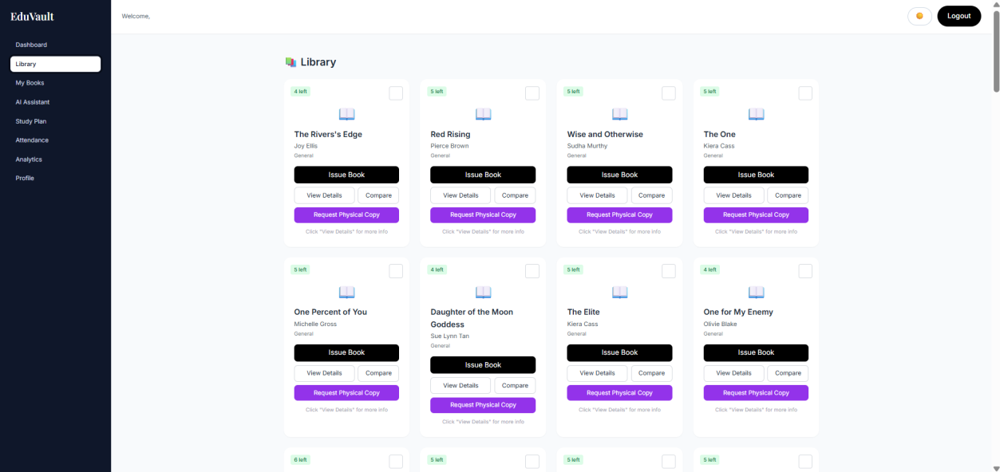
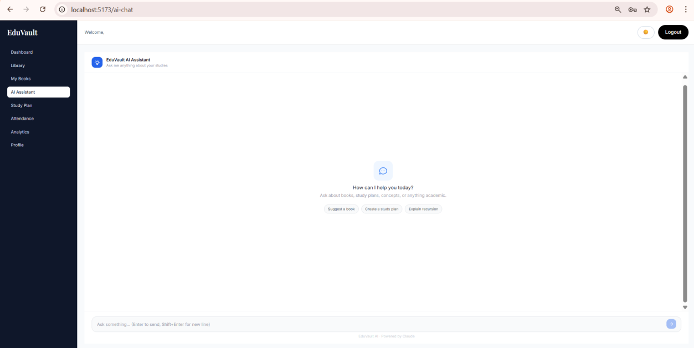
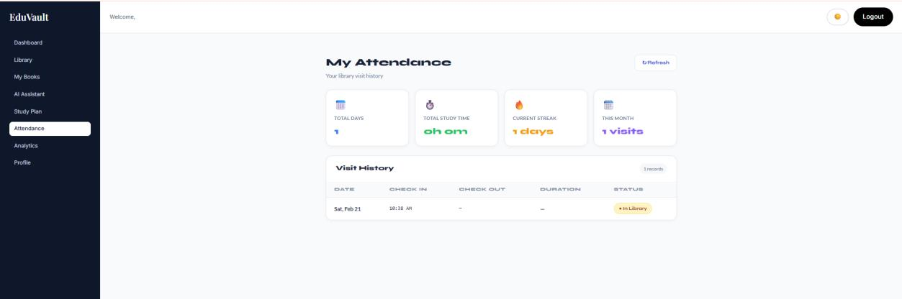
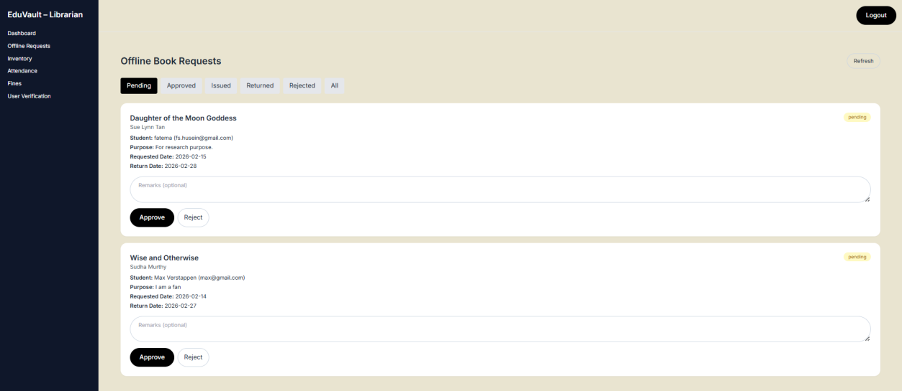
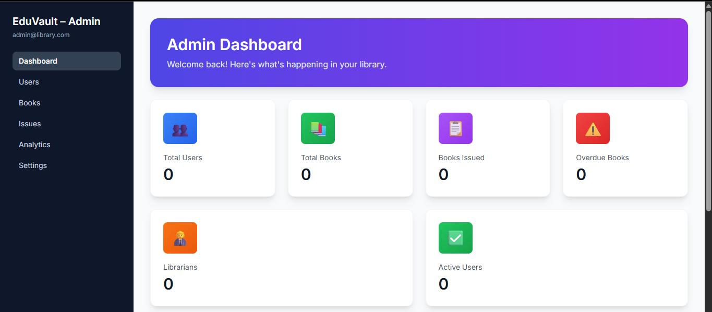

# EduVault — The Smart E-Library

EduVault is an intelligent, web-based Open Library Management System built to automate and modernize academic library operations. It combines a secure digital issuing system, an AI-powered study planner, real-time analytics, and QR-based attendance into a single platform for students, librarians, and administrators.

Built as a final-year BSc IT project at Sophia College for Women (Empowered Autonomous), University of Mumbai.

---

## Overview

Most academic libraries still run on manual or partially digitized systems, which creates operational inefficiencies and poor integration between physical inventory and digital records. EduVault solves this with a unified, scalable platform that supports both online issuing and librarian-validated offline issuing, while keeping physical and digital records in sync.

Beyond core library functions, EduVault integrates a cloud-based AI assistant for academic support, an inventory management module for librarians, and a QR-based attendance system that automatically logs library visits. It's built on a client-server architecture with a relational database backend for secure, scalable, and reliable performance.

## Key Features

- **Hybrid Book Issuing** — online self-issuing plus librarian-validated offline issuing, kept in sync with physical inventory
- **AI-Based Study Planner** — generates personalized reading schedules based on selected books, deadlines, and available study time
- **AI Assistant** — a cloud-based chat assistant for academic queries, book suggestions, and study plan creation
- **Real-Time Dashboard** — tracks issued books, reading progress, attendance, and study streaks
- **QR-Based Attendance** — automatic, timestamped library visit logging via QR scan
- **Inventory Management** — full stock tracking and synchronization for librarians
- **Role-Based Access Control** — separate, permission-scoped interfaces for Users, Librarians, and Admins
- **Progressive Web App** — installable, responsive, and partially functional offline

## Tech Stack

**Backend**
- Python
- Django
- Django REST Framework (REST API layer)

**Database**
- PostgreSQL

**Frontend**
- React
- Vite
- Tailwind CSS
- Progressive Web App (PWA)

**Auth & Security**
- Token/JWT-based authentication
- Role-based access control (User, Librarian, Admin)
- CSRF protection, HTTPS-enabled communication

**Tooling**
- Git for version control
- VS Code / PyCharm
- Nginx / Apache for deployment

## System Architecture

EduVault follows a modular, layered architecture split into presentation, application, and persistence layers. The React/Vite frontend communicates with the Django REST Framework backend over secure REST APIs, with PostgreSQL handling structured, transactional data storage. The system is organized into eight independent but interconnected modules:

1. **Authentication Module** — registration, login, credential validation, role assignment, session/token management
2. **Book Management Module** — add/update records, search and filter, availability tracking
3. **Issuing and Transaction Module** — online issuing, librarian-validated offline issuing, transaction history, duplicate/invalid issuance prevention
4. **Study Planner Module** — reading workload calculation, personalized schedule generation, progress tracking
5. **Dashboard and Monitoring Module** — real-time academic activity insights
6. **Inventory Management Module** — stock records, issuing sync, consistency checks
7. **QR-Based Attendance Module** — QR validation, timestamped logging, attendance reports
8. **AI Assistant Module** — academic query handling, navigation support, external AI service integration

## Screenshots

### User Interface

**Dashboard** — real-time overview of issued books, study streaks, and active study plans


**Library** — searchable, filterable book catalog with online issuing and physical copy requests


**AI Assistant** — chat-based academic support integrated directly into the app


**Attendance** — auto-logged library visits with streaks and visit history


**Register** — account creation with automatic QR code generation


### Librarian Interface

**Offline Requests** — approve or reject librarian-validated offline issuing requests


### Admin Interface

**Admin Dashboard** — system-wide view of users, books, issues, and overdue tracking


## Getting Started

### Prerequisites

- Python 3.10 or above
- Node.js (LTS) with npm or yarn
- PostgreSQL Server
- Git

### Backend Setup

```bash
# Clone the repository
git clone https://github.com/samimahussain/smart-libray-system.git
cd smart-libray-system/backend

# Create and activate a virtual environment
python -m venv venv
venv\Scripts\activate      # Windows
source venv/bin/activate   # macOS/Linux

# Install dependencies
pip install -r requirements.txt

# Configure environment variables (database credentials, secret key, etc.)
cp .env.example .env

# Run migrations
python manage.py migrate

# Start the development server
python manage.py runserver
```

### Frontend Setup

```bash
cd smart-libray-system/frontend

# Install dependencies
npm install

# Start the development server
npm run dev
```

## Feasibility Highlights

- **Technical** — built entirely on mature, well-documented, widely adopted technologies (Django, DRF, PostgreSQL, React), keeping implementation risk low
- **Economic** — relies on open-source tooling throughout, so there are no licensing costs; primary expenses are limited to hosting and maintenance
- **Operational** — browser-based access with no specialized software installation required, keeping the learning curve low for both students and librarians

## Limitations and Future Scope

- Core features (authentication, issuing, dashboard, AI assistant) require continuous internet connectivity
- Offline functionality is currently limited to librarian-validated offline issuing
- The AI assistant currently supports general assistance and system interaction, without deep academic reasoning or full contextual understanding of user goals
- Reading progress updates are currently manual rather than automatically tracked

## Team

- **Samima Hussain** — Roll No. T23019
- **Sakina Jawadwala** — Roll No. T23022

Developed under the guidance of Prof. Saqueba Mistry, Department of Information Technology, Sophia College for Women (Empowered Autonomous), University of Mumbai.

## License

All rights reserved. This project is shared publicly for portfolio and educational purposes only. Reuse, redistribution, or reproduction of this code without explicit permission is not permitted.
